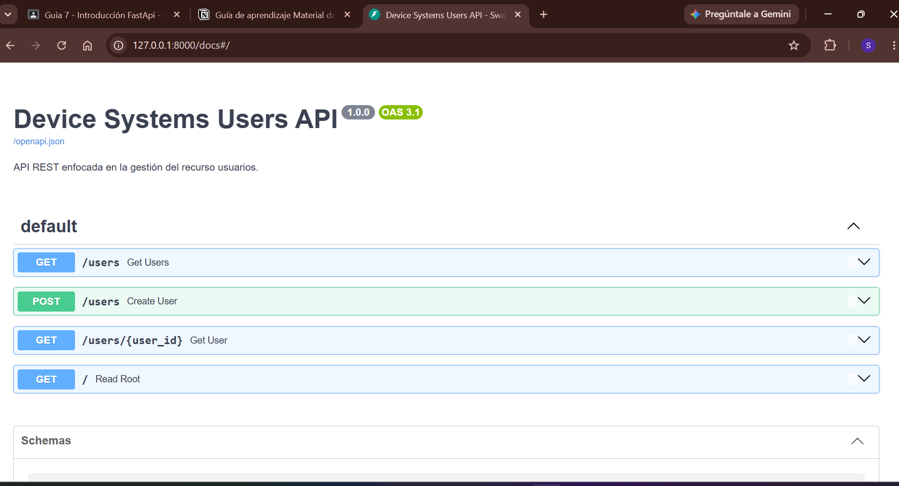
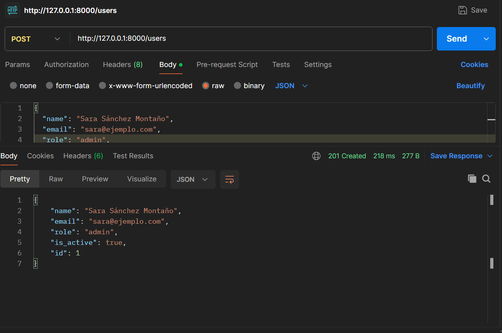
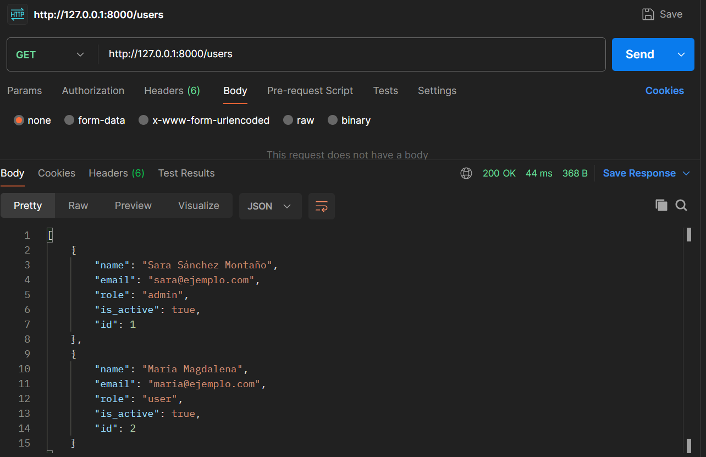
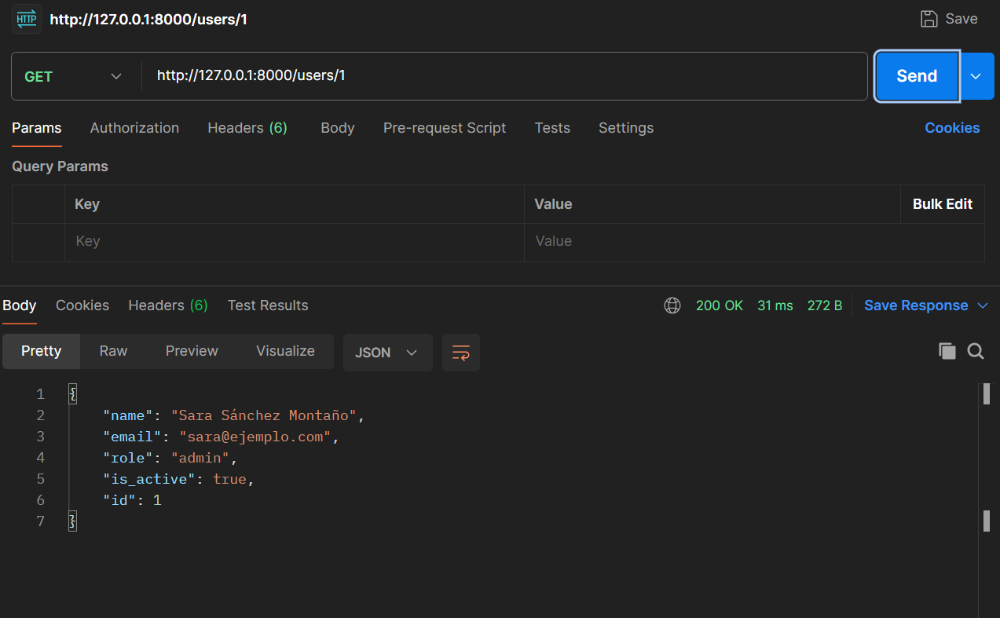
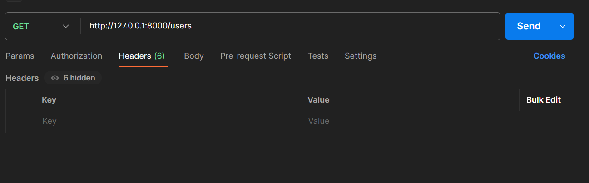
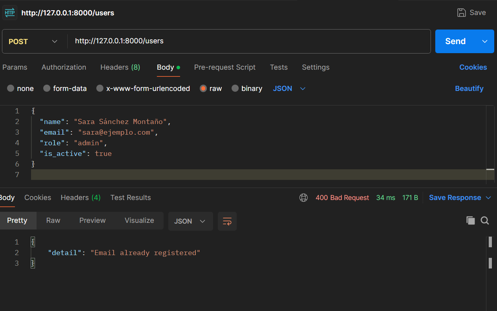
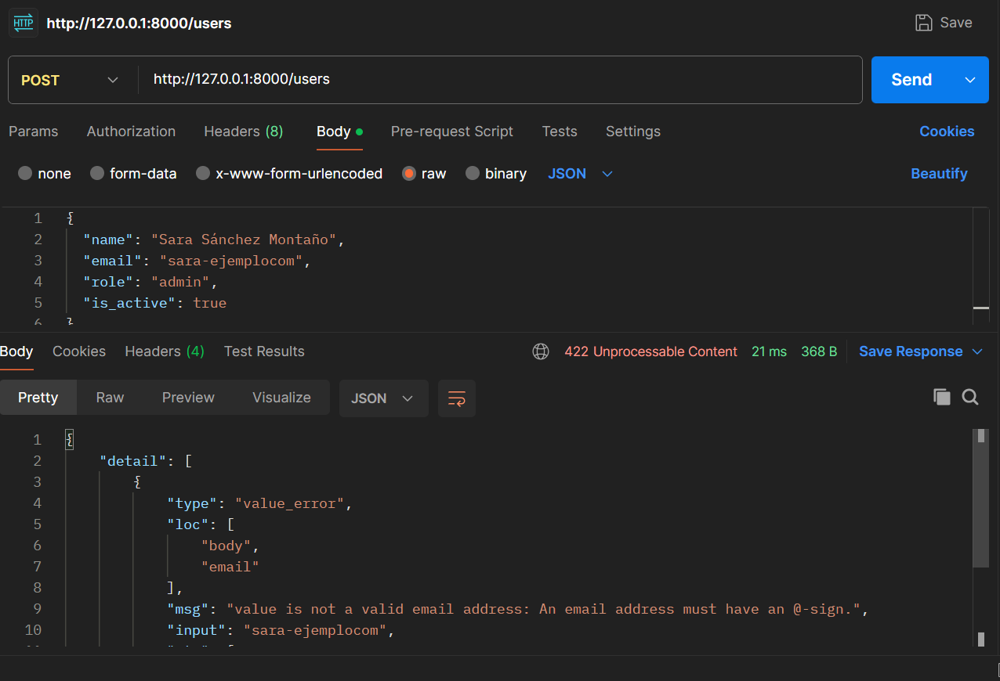
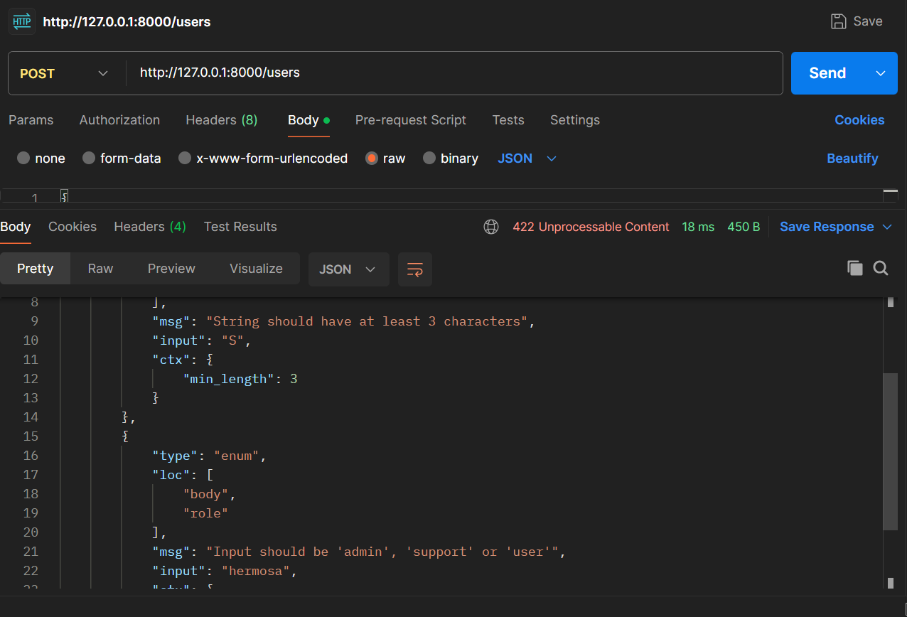

# device_systems API

## Descripción de la aplicación

**device_systems** es una API REST construida con **FastAPI** orientada a la gestión de usuarios de un sistema de dispositivos. Permite crear, consultar y filtrar usuarios con validaciones estrictas de datos gracias a **Pydantic v2**. La API implementa los métodos HTTP GET y POST, maneja Path Parameters y Query Parameters, incluye Response Models y cabeceras HTTP personalizadas.

---

## Instalación de dependencias

Asegúrate de tener Python instalado. Luego, crea un entorno virtual e instala las dependencias:

```bash
# Crear entorno virtual
python -m venv venv

# Activar entorno virtual (Windows)
venv\Scripts\activate

# Instalar dependencias
pip install -r requirements.txt
```

---

## Ejecución del servidor

Para ejecutar el servidor de desarrollo, utiliza Uvicorn:

```bash
uvicorn app.main:app --reload
```

La API estará disponible en `http://127.0.0.1:8000`.  
La documentación interactiva (Swagger UI) estará en `http://127.0.0.1:8000/docs`.

---

## Tabla de Endpoints

| Método | Endpoint               | Descripción                                          |
|--------|------------------------|------------------------------------------------------|
| GET    | `/users`               | Listar todos los usuarios. Permite filtros.          |
| GET    | `/users?role=admin`    | Filtrar usuarios por rol (admin, support, user).     |
| GET    | `/users?is_active=true`| Filtrar usuarios por estado activo/inactivo.         |
| GET    | `/users/{user_id}`     | Consultar un usuario específico por su ID.           |
| POST   | `/users`               | Registrar un nuevo usuario con validación de datos.  |

---

## Ejemplos de Peticiones

### POST /users — Crear un usuario

```json
POST http://127.0.0.1:8000/users
Content-Type: application/json

{
  "name": "Ana Silva",
  "email": "ana@correo.com",
  "role": "admin",
  "is_active": true
}
```

### GET /users — Listar todos los usuarios

```
GET http://127.0.0.1:8000/users
```

### GET /users?role=admin — Filtrar por rol

```
GET http://127.0.0.1:8000/users?role=admin
```

### GET /users?is_active=true — Filtrar por estado

```
GET http://127.0.0.1:8000/users?is_active=true
```

### GET /users/{user_id} — Obtener usuario por ID

```
GET http://127.0.0.1:8000/users/1
```

---

## Capturas de Swagger UI / Evidencias de pruebas

### Swagger UI — Documentación automática


### POST /users — Creación exitosa (201 Created)


### GET /users — Listar usuarios


### GET /users/{user_id} — Búsqueda por ID


### Headers HTTP personalizados (X-App-Name / X-API-Version)


### Error — Correo duplicado (400 Bad Request)


### Error — Correo con formato inválido (422)


### Error — Nombre corto y rol inválido (422)


---

## Reflexión

El uso de **FastAPI** facilita enormemente la creación de APIs REST gracias a su integración con **Pydantic v2** para la validación automática de datos y la auto-generación de documentación interactiva con Swagger UI. El tipado estático de Python ayuda a prevenir errores en tiempo de desarrollo, y la estructura por rutas y schemas hace que el código sea limpio, organizado y fácil de mantener. Esta actividad permitió comprender cómo construir una API real con buenas prácticas desde el inicio.
